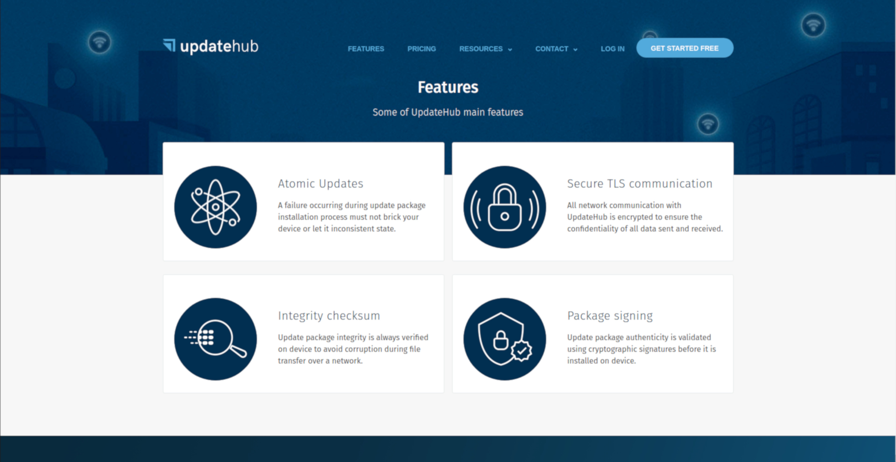

# Creating a new account

Just click on the GET STARTED button

Fill with your data in the requested fields and press the register button

You will receive a confirmation link in your email \(please look at your spam box!\). Click on the link to confirm your account and a new window will open where you must click on the confirmation button. Here you see your email address and your UpdateHub user name.

Now you can see a Welcome Screen indicating you are logged into your UpdateHub account.

