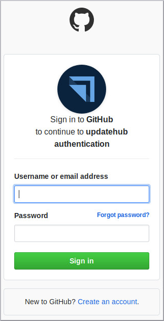

# Login with GitHub

Sign in UpdateHub using your GitHub account. If you like to use your GitHub account to go into a **UpdateHub** so after click on the GET STARTED FREE button and you see the screen form. Just press the button “Login with GitHub” go ahead. Will be open a GitHub logging window then you fill in your data access and press the button SIGN IN.   

