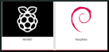

# Step-1

**Recording the OS image in your device `Raspberry Pi`**

The first step is record the image in the SD card. In this example we will use a image minimal.

**How to do this?**

If you are a Yocto Project user follow the steps clicking here  and follow the steps.

If you want run a Raspbian OS image just click here  and follow their steps to install the image.
