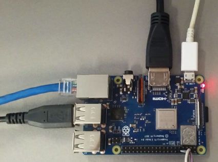

# Step-2

**Connecting the device**

- After saving the image to the SD card you must insert it into the device.  
- Connect the Network cable, keyboard and video (the keyboard and video are optional).
- Plug in the power supplier.  
- Wait for the device to turn on and the command line appear on the screen.  
- Now login using `$ root` and don't need enter a password.

After you connect all your device will be as shown below:  

