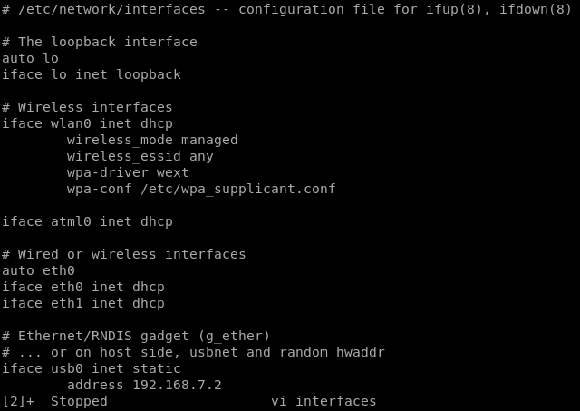
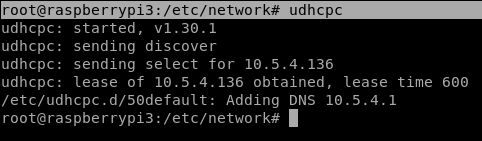
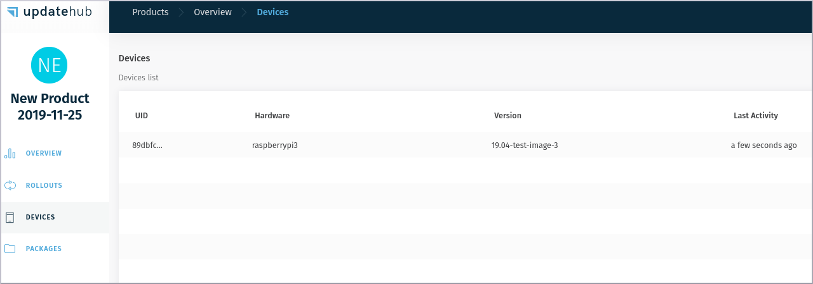

# Step-4

To clarify any questions you have about how the internet works on your device, here's a case that might happen to you as well.

In the figure below an example of interfaces file:

  

Then after your device has internet access UpdateHub will display it on screen as you can see in the picture below:

  

Then in the next time that you login in the UpdateHub your device will be there.
  
