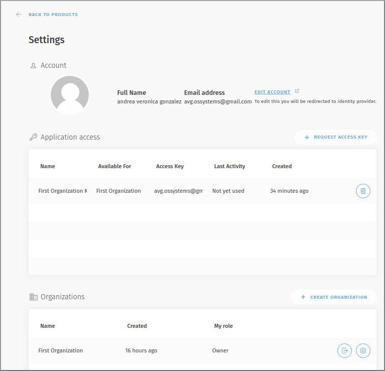
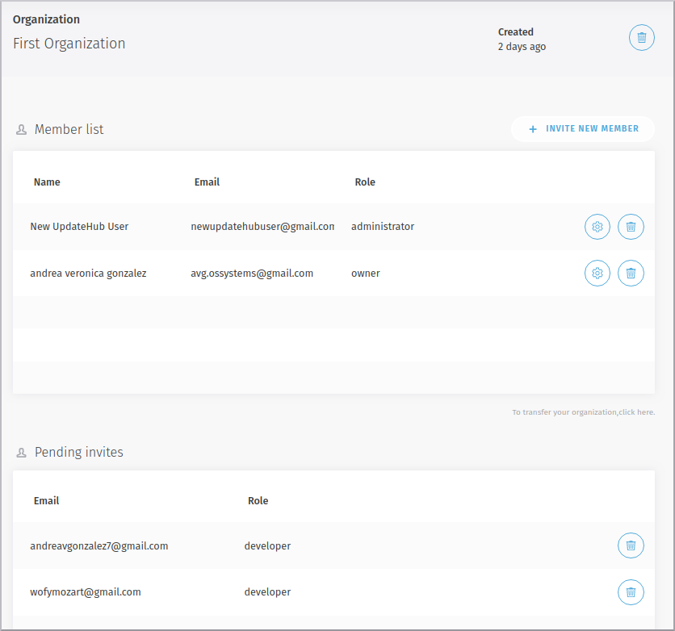

# Inviting People to Work

If you want to invite people to work with you as a team, after creating an organization, go to the configuration icon next to your name as shown in figure below, click on it and open the settings page.

Scroll down until the organizations you created appear. Click on the settings icon for the organization you want to invite people to work and you will then be within that organization's page as shown in figure below.

Now just click on the INVITE NEW MEMBER link and on the next screen enter the email of your guest and choose an activity for them, then just click send invitation.

Your guest will receive a message as you can see in the next figure.

 Until the guest accept the invitation you will be seen on your workspace a pending invite and after the guest accept the invitation the status invitation will be change as shown next.

