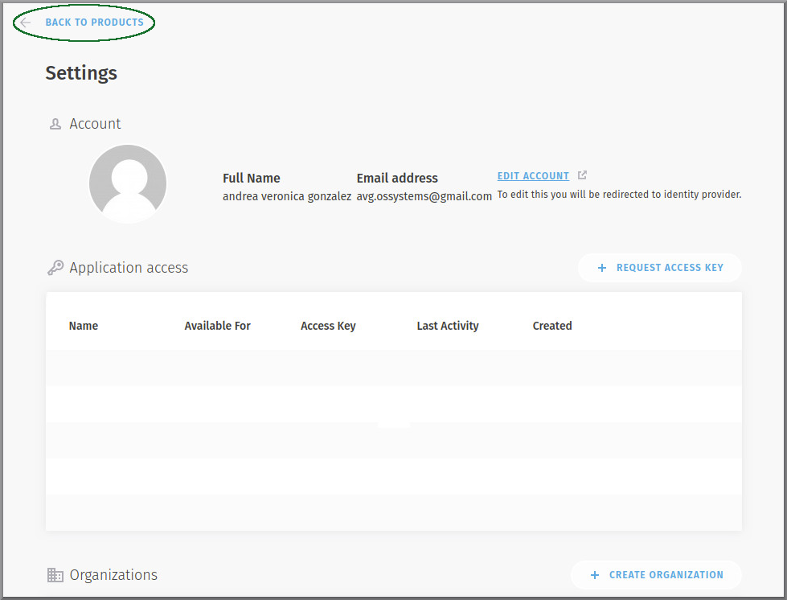
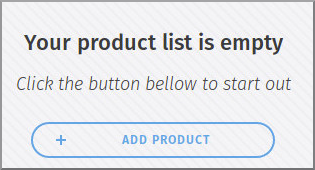
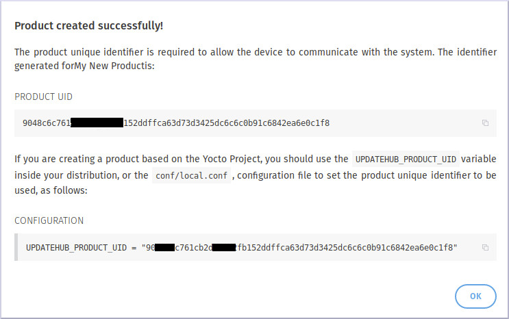
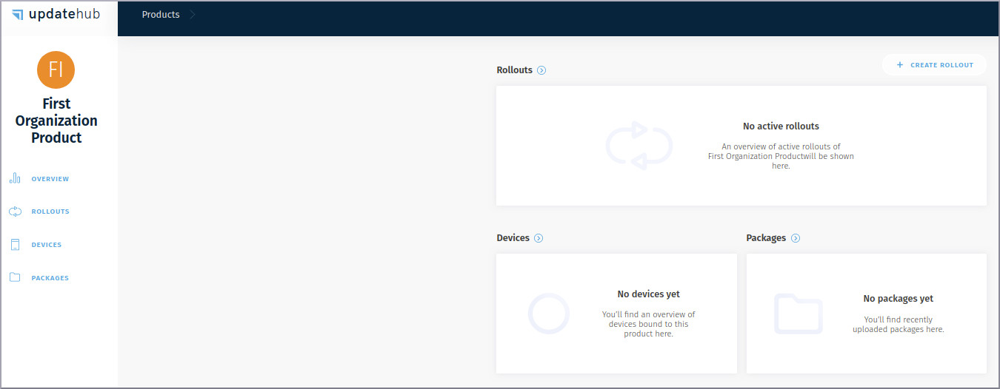
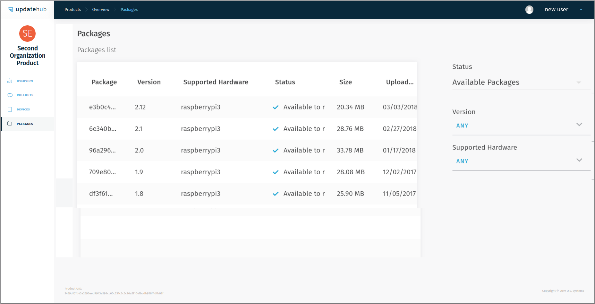

# Creating a Product

To you create one product is to easy just click on the BACK TO PRODUCTS link  and you will be again in the [welcome screen](creatingorganization.md).

Now you should press the add product button and fill the form with your product name and the owner.

Here you should use the organization because after you create a product you can not deleted it, so have sure you are choosing the correct owner.

>_If you want to create a product that you will use in a single job, just select the product owner as “Me”, but remember that you can not transfer the products to the organization or vice versa._

After you select the product owner you need press the create button and “voilà” your first organization product is created.

😌😌😌 If you want to copy the identifier to use in your project just click in the square on the right identifier number as shown in figure above.

After you press the OK button you will be into the products screen where you can see all your products, rollouts, devices and packages.

Now we had a product and an available package so in the next pages will learn a little more about it.

1. Package ID -->
2. Package Version -->
3. Supported Hardware -->
4. Package Status -->
5. Package Size -->
6. Package Upload Date -->

If you make changes in your product and send this changes to your UpdateHub product the package will be appear in the Package List.

>_If you want see package by the status just click on the drop down menu on the left of Package List._
